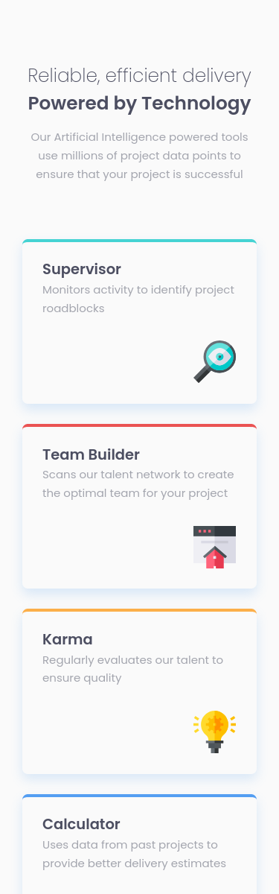
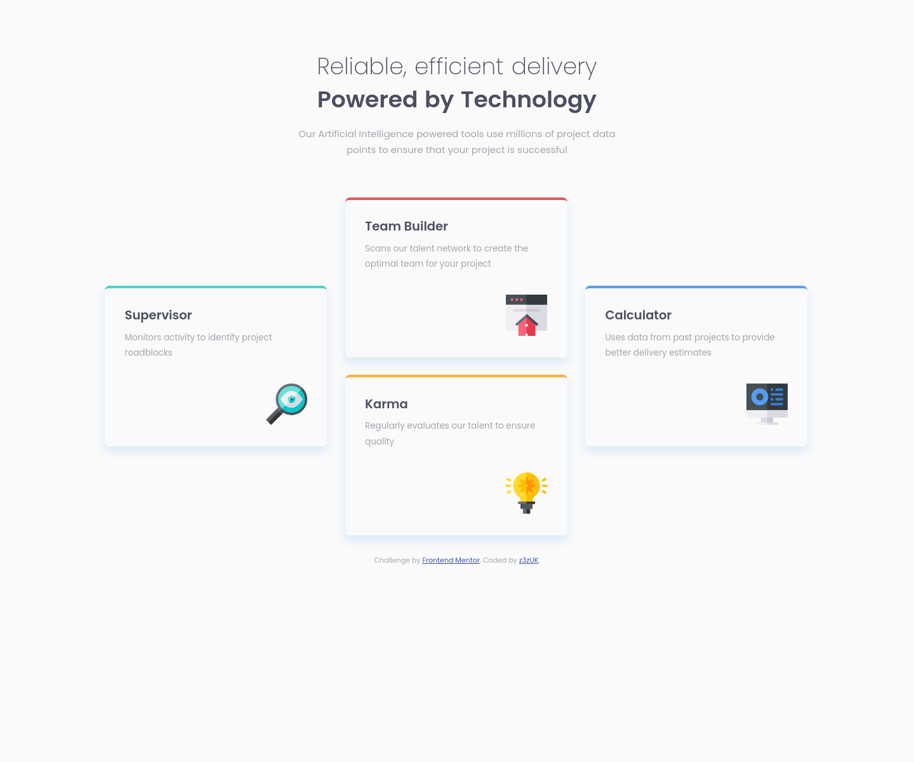

# Frontend Mentor - Four card feature section solution

This is a solution to the [Four card feature section challenge on Frontend Mentor](https://www.frontendmentor.io/challenges/four-card-feature-section-weK1eFYK). Frontend Mentor challenges help you improve your coding skills by building realistic projects.

## Table of contents

- [The challenge](#the-challeng
- [Screenshot](#screenshot)
- [Links](#links)
- [Built with](#built-with)
- [What I learned](#what-i-learned)

### The challenge

Users should be able to:

- View the optimal layout for the site depending on their device's screen size

### Screenshot

### Links

- Solution URL: [Git Hub Repository](https://github.com/z3zUK/FEM-Projects/tree/main/FEM-Four-card-feature-section)
- Live Site URL: [Git Hub Pages Link](https://z3zuk.github.io/FEM-Projects/FEM-Four-card-feature-section/index.html)

### Built with

- Semantic HTML5 markup
- CSS custom properties
- CSS Grid
- Mobile-first workflow

### What I learned

It was fun to experiment with Grid to create the desktop view.
