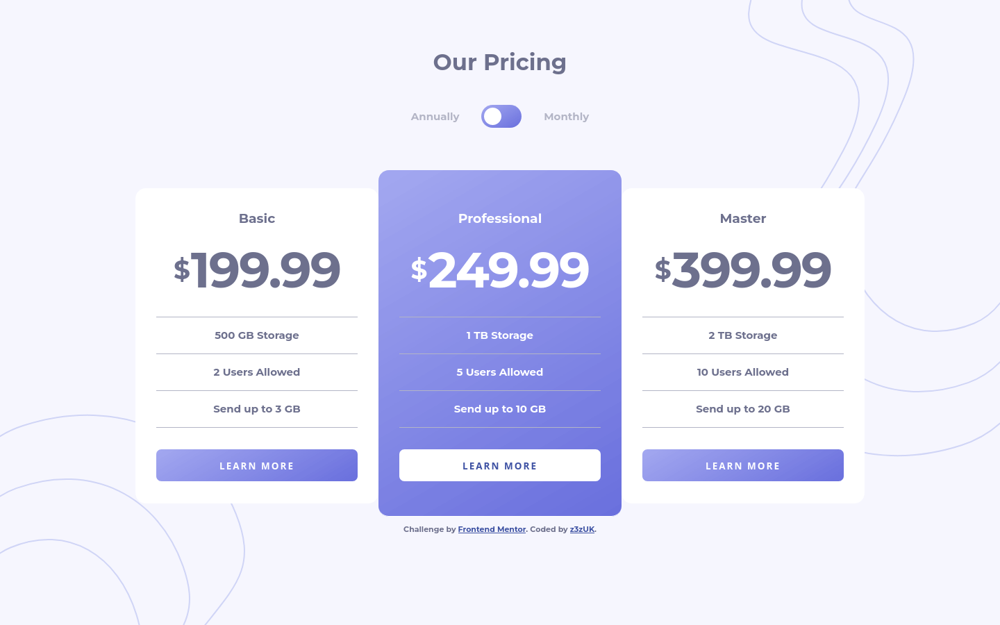

# Frontend Mentor - Pricing component with toggle solution

This is a solution to the [Pricing component with toggle challenge on Frontend Mentor](https://www.frontendmentor.io/challenges/pricing-component-with-toggle-8vPwRMIC). Frontend Mentor challenges help you improve your coding skills by building realistic projects.

## Table of contents

- [The challenge](#the-challenge)
- [Screenshot](#screenshot)
- [Built with](#built-with)
- [What I learned](#what-i-learned)

### The challenge

Users should be able to:

- View the optimal layout for the component depending on their device's screen size
- Control the toggle with both their mouse/trackpad and their keyboard

### Screenshot

### Links

- Solution URL: [Add solution URL here](https://z3zuk.github.io/FEM-Projects/FEM-Pricing-component-with-toggle/index.html)
- Live Site URL: [Add live site URL here](https://github.com/z3zUK/FEM-Projects/tree/main/FEM-Pricing-component-with-toggle)

### Built with

- Semantic HTML5 markup
- CSS custom properties
- Flexbox
- Mobile-first workflow

### What I learned

Spent a while trying to get the design to line up as closely as possible to the original files. Tried to make a CSS only toggle, but it wasn't working for me with the code I'd already written, so took the easy option with a javascript toggle.
