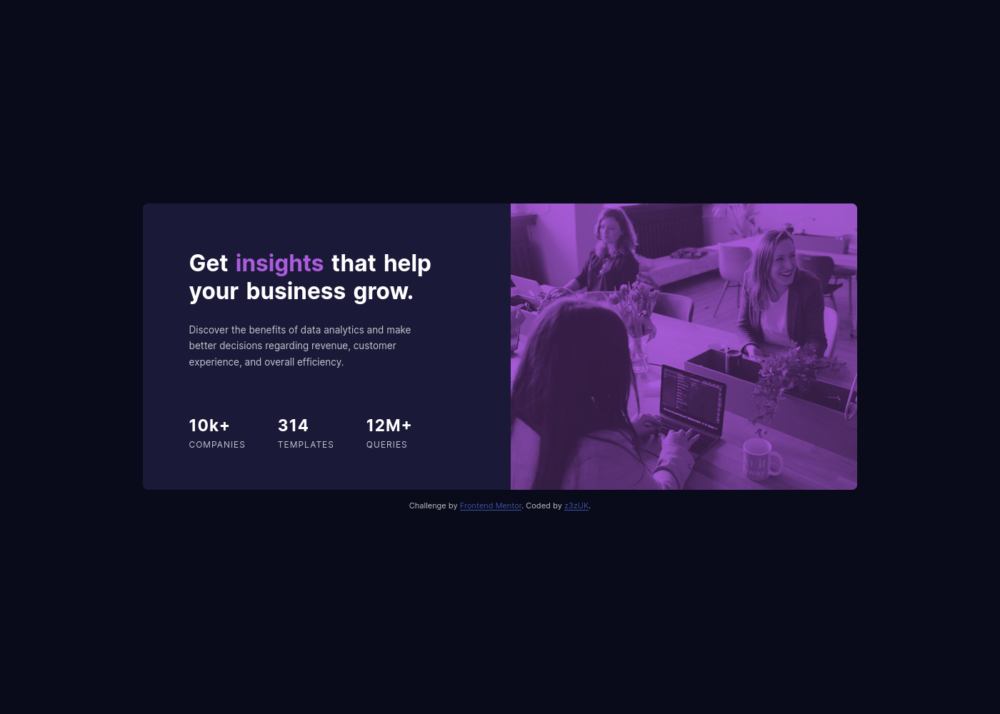
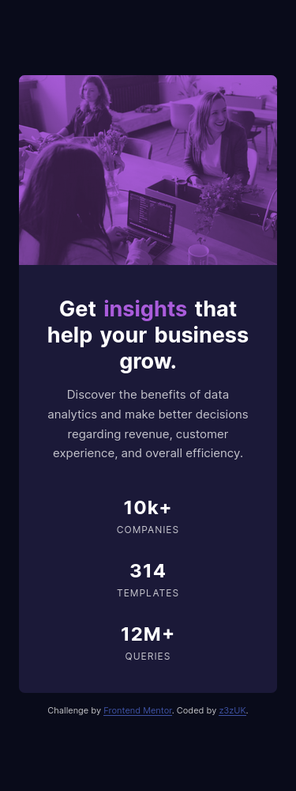

# Frontend Mentor - Stats preview card component solution

This is a solution to the [Stats preview card component challenge on Frontend Mentor](https://www.frontendmentor.io/challenges/stats-preview-card-component-8JqbgoU62). Frontend Mentor challenges help you improve your coding skills by building realistic projects.

## Table of contents

- [The challenge](#the-challenge)
- [Screenshot](#screenshot)
- [Links](#links)
- [Built with](#built-with)
- [What I learned](#what-i-learned)
- [Continued development](#continued-development)

### The challenge

Users should be able to:

- View the optimal layout depending on their device's screen size

### Screenshot

### Links

- Solution URL: [GitHub Repository](https://github.com/z3zUK/FEM-Projects/tree/main/FEM-Stats-Preview-Card-Component)
- Live Site URL: [GitHub Pages link](https://z3zuk.github.io/FEM-Projects/FEM-Stats-Preview-Card-Component/index.html)

### Built with

- Semantic HTML5 markup
- CSS custom properties
- Flexbox
- CSS Grid
- Mobile-first workflow

### What I learned

I had already done another card mockup, so this one was fairly easy, as the main elements were broadly similar. Hardest part is getting the alignment as close as possible to the original design. Took me a little while to figure out which blend mode/opacity level to use for the main image!

### Continued development

Going to try a larger project for my next challenge, and I'll see how that goes!!
