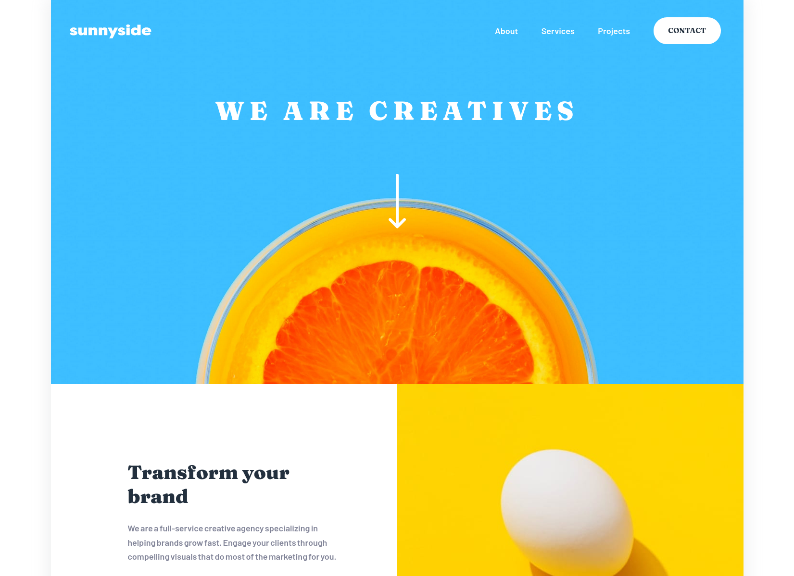

# Frontend Mentor - Sunnyside agency landing page solution

This is a solution to the [Sunnyside agency landing page challenge on Frontend Mentor](https://www.frontendmentor.io/challenges/sunnyside-agency-landing-page-7yVs3B6ef). Frontend Mentor challenges help you improve your coding skills by building realistic projects.

## Table of contents

- [The challenge](#the-challenge)
- [Screenshot](#screenshot)
- [Links](#links)
- [Built with](#built-with)
- [What I learned](#what-i-learned)
- [Useful resources](#useful-resources)

### The challenge

Users should be able to:

- View the optimal layout for the site depending on their device's screen size
- See hover states for all interactive elements on the page

### Screenshot

### Links

- Solution URL: [Git Hub Repository](https://github.com/z3zUK/FEM-Projects/tree/main/sunnyside-agency-landing-page-main)
- Live Site URL: [Live Site URL](https://z3zuk.github.io/FEM-Projects/sunnyside-agency-landing-page-main/index.html)

### Built with

- Semantic HTML5 markup
- CSS custom properties
- Flexbox
- CSS Grid
- Mobile-first workflow
- CSS only mobile menu

### What I learned

Found some code for a CSS only hamburger menu, which - with quite a bit of tweaking - I implemented in the mobile view of the site.

### Useful resources

[CSS Hamburger menu](https://code-boxx.com/simple-responsive-pure-css-hamburger-menu/) - Based my menu off this code
